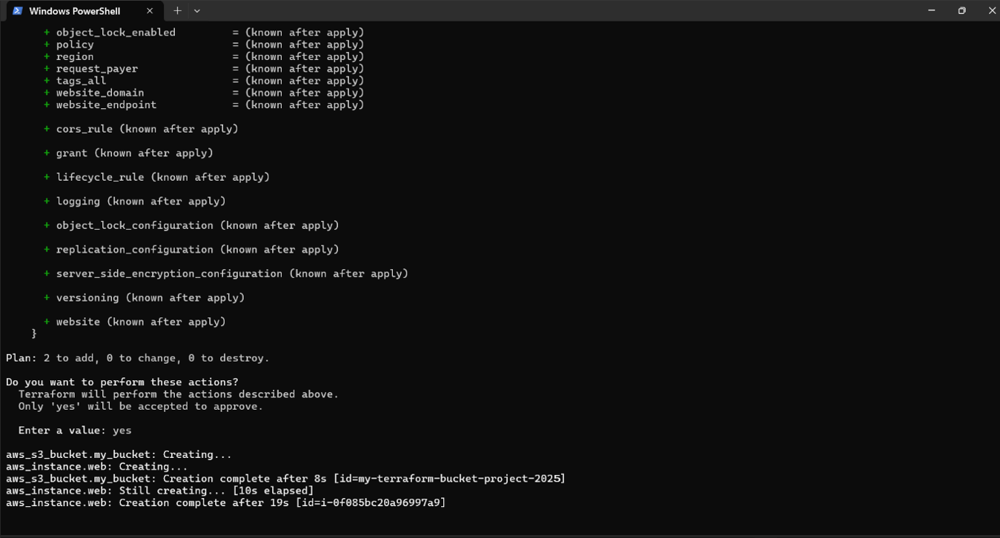
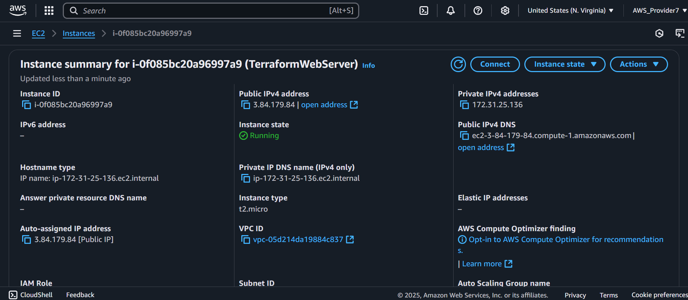
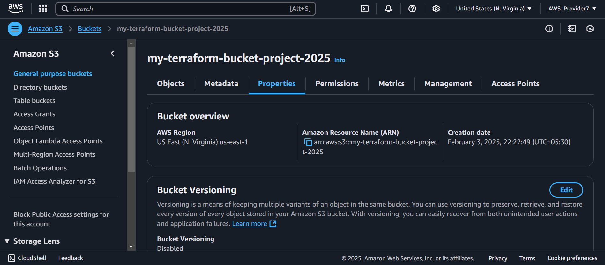

# 🚀 Automated AWS Infrastructure with Terraform

[](https://www.terraform.io)
[](https://aws.amazon.com)

This project automates the provisioning of an **EC2 instance** and **S3 bucket** on AWS using Terraform, demonstrating Infrastructure as Code (IaC) skills.

## 🛠️ Features
- **EC2 Instance**: Deployed a t2.micro instance (free-tier eligible) with Amazon Linux 2.
- **S3 Bucket**: Created a private S3 bucket with secure ACL settings.
- **Cost Optimization**: Leveraged AWS Free Tier to minimize costs.
- **Security**: Blocked public access to S3 by default.

## 📂 Repository Structure

```
terraform-aws-ec2-s3-project/  
├── web-server-files/  
│   └── main.tf  
├── assets/  
│   ├── ec2-instance.png  
│   ├── s3-bucket.png  
│   └── Terraform-Apply.png    
└──README.md  
 ```

## 📸 Screenshots  
### 1. The 'terraform apply' output:  
  

### 2. EC2 Instance Created  
  

### 3. S3 Bucket Created  
  

## 🛠️ Technologies Used  
- **Terraform**: Infrastructure as Code.  
- **AWS EC2**: Virtual server hosting.  
- **AWS S3**: Object storage.  

## 🔧 How to Run Locally  
1. Clone this repository:  
   ```bash  
   git clone https://github.com/git-hub-user7/terraform-aws-project.git

   cd terraform-aws-ec2-s3-project/code

2. Initialize Terraform:

```bash
terraform init
```

3. Plan & Deploy:

```bash
terraform plan
terraform apply
```

4. Clean Up (Avoid Costs):

```bash
terraform destroy
```

## 📝 Key Learnings

Infrastructure as Code (IaC) with Terraform.

AWS resource provisioning (EC2, S3).

Security best practices (private S3 buckets).

Cost optimization using AWS Free Tier.


## 🔜 Future Improvements

Add a CI/CD pipeline with GitHub Actions.

Implement remote state management using AWS S3.

Use variables for dynamic configurations.


👨💻 Author  
  **Dhwarakesh Srinivasan**
